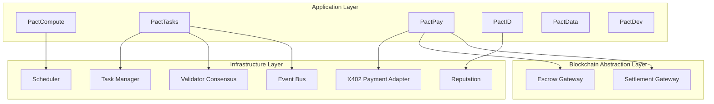

# PACT Network Core (Bun + TypeScript)

PACT Network 核心框架实现，基于白皮书 v3.0（2026-02）中的分层架构与机制设计，覆盖任务市场、验证流水线、信誉系统、匹配算法、支付分账与事件驱动编排。

## Architecture (ASCII)

```text
┌──────────────────────────────────────────────────────────────────────────┐
│                      Application Layer                                   │
│  PactCompute | PactTasks | PactPay | PactID | PactData | PactDev        │
├──────────────────────────────────────────────────────────────────────────┤
│                    Infrastructure Layer                                  │
│ Task Manager | Validator Consensus | Reputation | Scheduler              │
│ X402 Payment Adapter | Event Bus                                         │
├──────────────────────────────────────────────────────────────────────────┤
│                    Blockchain Abstraction Layer                          │
│ Escrow Gateway | Settlement Gateway (Base-chain abstraction)             │
└──────────────────────────────────────────────────────────────────────────┘
```

## Architecture (Mermaid)



## Key Features

- 任务状态机：`Created → Assigned → Submitted → Verified → Completed`
- 非法状态迁移抛错：`IllegalStateTransitionError`
- 三层验证流水线：`Auto AI → Agent Validators → Human Jury`
- 可配置验证参数：阈值、层级开关、最少验证人数
- 信誉评分：`0-100`，自动 clamp
- 匹配算法：Gale-Shapley 变体 + 约束过滤（技能、距离、信誉、容量）
- 支付分账：`85% Worker / 5% Validators / 5% Treasury / 5% Issuer`
- REST API：Hono + 事件驱动编排
- 全 in-memory adapters（便于扩展到真实链上组件）

## Project Structure

```text
src/
  api/
  application/
    modules/
  domain/
  infrastructure/
  blockchain/
tests/
docs/
```

## Quick Start

```bash
bun install
bun test
bun run dev
```

默认服务地址：`http://localhost:3000`

## API Overview

- `POST /id/participants` 注册参与者（worker/validator/issuer/...）
- `GET /id/workers` 查询 worker
- `POST /tasks` 创建任务（自动建 escrow）
- `POST /tasks/:id/assign` 指派或自动匹配 worker
- `POST /tasks/:id/submit` 提交证据并触发验证/结算编排
- `GET /tasks` / `GET /tasks/:id` 查询任务
- `GET /payments/ledger` 查询分账流水
- `POST /compute/jobs` 新建计算任务
- `POST /data/assets` 发布数据资产
- `POST /dev/integrations` 注册开发集成

## Testing

```bash
bun test
```

覆盖状态机、验证流水线、匹配算法、分账逻辑、API 事件驱动端到端流程。

## Docs

- `docs/architecture.md`
- `docs/domain-model.md`
- `docs/api.md`
